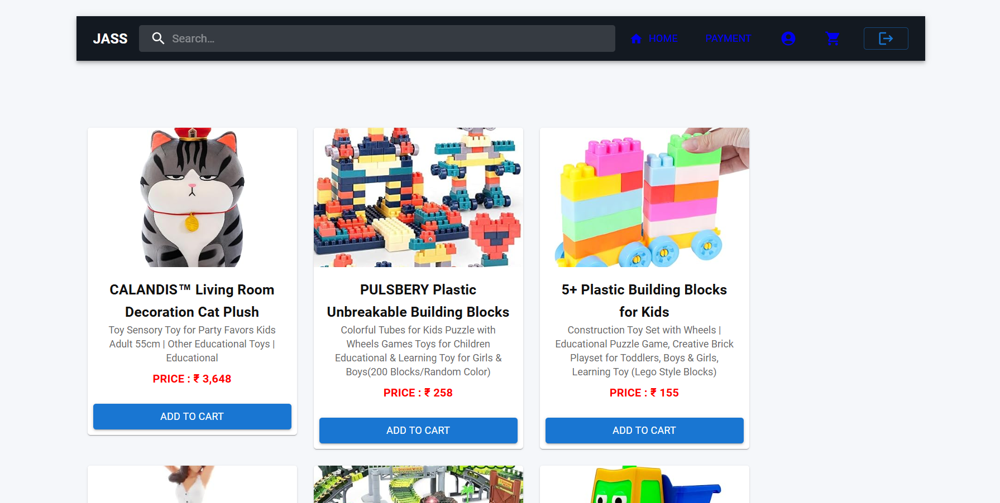

**# 🛒 E-Commerce Website

### My First Web Development Project

This is my first e-commerce website project, developed as part of my learning journey in web development.

I completed this project with the help of a guide while learning how different web technologies work together to create an e-commerce website.

## 📸 Website Preview

## 📌 About the Project

This project is a basic e-commerce website that demonstrates the structure and functionality of an online shopping website.

It includes frontend pages, JavaScript functionality, and JSON-based data.

## 🛠️ Technologies Used

- HTML
- CSS
- JavaScript
- React
- Node.JS

## 🎯 Purpose

The main purpose of this project was to gain practical experience in web development and understand the basic structure of an e-commerce website.

## 📚 What I Learned

Through this project, I gained basic exposure to:

- HTML webpage structure
- CSS styling
- JavaScript
- JSON data
- Website navigation
- Basic e-commerce website structure
- Working with a guided project

## 💭 Learning Experience

This was my first project, and I completed it with the help of a guide.

It helped me understand how different parts of a website can work together and gave me practical experience beyond classroom learning.

I am continuing to improve my understanding of web development and programming through further practice and projects.

## 🚀 Future Learning

- Improve JavaScript skills
- Learn advanced frontend development
- Understand backend development in more depth
- Learn database integration
- Build more independent projects
- Improve full-stack development skills

## 👩‍💻 Author

**Sneha Suresh**

BCA (Hons.) Student  
Aspiring Python Developer

---

⭐ My first step into web development.**
